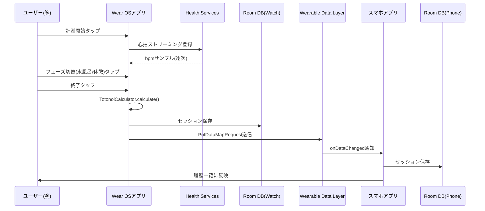

# アーキテクチャ

## モジュール構成

```
AndroidSaunaProject/
├── shared/   Androidライブラリ。ドメインロジック・DB・共通モデル(Wear/Mobile両方から参照)
├── wear/     Wear OS単体アプリ(心拍計測・セッション記録・スマホへの同期送信)
└── mobile/   スマホアプリ(履歴閲覧。Wearからの同期データを受信してRoomに保存)
```

パッケージルートは `com.totonoi.sauna`。

```
com.totonoi.sauna.shared
├── model        SessionPhase / HeartRateSample / PhaseSegment / SaunaSession
├── calculator   TotonoiCalculator (ととのい値算出ロジック)
├── db           Room: SaunaSessionEntity / SaunaDao / SaunaDatabase
├── repository   SaunaSessionRepository (Room⇄ドメインモデルの変換)
└── sync         DataLayerKeys (Wear⇔Mobile間のDataMapキー定義)

com.totonoi.sauna.wear
├── health       HeartRateMeasurer (Health Services MeasureClientのラッパー)
├── session      SessionViewModel / SessionSyncSender
├── ui           SaunaApp / HomeScreen / MeasuringScreen / ResultScreen
└── MainActivity

com.totonoi.sauna.mobile
├── sync         SessionSyncListenerService (WearableListenerService)
├── ui           HistoryScreen / HistoryViewModel
└── MainActivity
```

## データフロー



## 主要な技術選定

| 項目                     | 選定                                       | 理由                                                                 |
| ------------------------ | ------------------------------------------ | -------------------------------------------------------------------- |
| 心拍取得                 | Health Services (`MeasureClient`)          | Google公式のWear OS標準API。バッテリー効率も良い                     |
| Wear⇔Mobile同期          | Wearable Data Layer (`DataClient`)         | 追加サーバー不要でGoogle Play Servicesのみで完結                     |
| ローカル永続化           | Room                                       | Wear/Mobile双方の`shared`モジュールで共通利用                        |
| UI                       | Jetpack Compose (Wear Compose / Material3) | Wear OS 3+の標準UIツールキット                                       |
| セッション記録の保存形式 | フェーズ列をJSON化してRoomの1カラムに格納  | Data LayerでやりとりするJSONとスキーマを揃え、変換コストを下げるため |

## 現状の制約・設計判断

- フェーズ(サウナ/水風呂/休憩)の切り替えは**ユーザーの手動タップ**が前提。心拍波形からの
  自動フェーズ検出は未実装(ロードマップ参照)。
- クラウド同期は未実装。現状は端末内(Wear/Mobileそれぞれ)のRoom DBにのみ保存。
