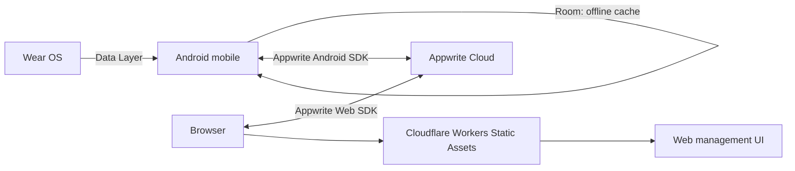

# クラウド化計画

## 結論

記録・認証基盤には **Appwrite Cloud**、Web 管理画面の配信には **Cloudflare Workers
Static Assets** を採用する。既存の ConoHa VPS はこの機能には使用しない。VPS に
Appwrite、Keycloak、PostgreSQL を追加で同居させる案も採用しない。

この構成なら、メールアドレス/パスワード、ソーシャルログイン、パスキーを1つの
アカウント基盤で提供し、Android/Wear OS と Web の双方から同じ記録を安全に操作できる。
既存アプリの Room は削除せず、オフライン時も計測を失わないローカル・キャッシュとして
残す。



## 現状と移行対象

現在、`SaunaSession` は `id`、開始/終了時刻、フェーズと心拍サンプル、スコア、セット数を
持ち、`RoomSaunaSessionRepository` が Wear とスマホの Room DB へ直接保存している。
スマホ側の削除は `DeletedSessionStore` の端末内 `SharedPreferences` に ID を残して
Wear からの再取り込みを抑止するだけである。そのため、アンインストール時に履歴と削除情報の
両方が失われ、別端末・Web との整合も取れない。

移行後の正本はクラウドとし、Room はオフライン・ファーストのレプリカとする。Wear OS は
認証画面を持たず、従来どおり Data Layer でペアリング済みスマホへ送信する。クラウド同期と
アカウント操作はスマホだけで行う。

## 採用構成

| 層                           | 採用                                    | 役割                                                            |
| ---------------------------- | --------------------------------------- | --------------------------------------------------------------- |
| 認証、記録 API、データベース | Appwrite Cloud                          | ユーザー、パスキー、OAuth、記録、アクセス権、バックアップを管理 |
| Android                      | Appwrite Android SDK、Room、WorkManager | ログイン、ローカル保存、バックグラウンド同期                    |
| Wear OS                      | 既存 Room、Wearable Data Layer          | 計測・一時保存・スマホへの送信                                  |
| Web 管理画面                 | React/Vite + Appwrite Web SDK           | 記録の一覧、詳細、編集、削除、アカウント管理                    |
| Web 配信                     | Cloudflare Workers Static Assets        | 静的 SPA の HTTPS 配信、グローバルキャッシュ、Git 連携デプロイ  |

Appwrite Cloud は 2026-09-01 時点で無料枠に 75,000 MAU、2GB ストレージ、5GB 帯域を含む。
初期リリースは無料枠で開始し、継続稼働、バックアップ、監視が必要になった時点で Pro
($25/月から) を評価する。無料プロジェクトは1週間無操作で停止するため、本番公開後に
停止が許容できない場合は Pro へ移行する。

Cloudflare Workers Free では静的アセット要求が無料・無制限であり、この Web SPA の配信に
月額は発生しない。Cloudflare は新規プロジェクトに Pages ではなく Workers を推奨しているため、
`assets.directory = "./dist"` と SPA fallback を設定した Workers Static Assets として配備する。
Appwrite Web SDK が認証・記録 API を直接呼ぶので、初期リリースに動的 Worker や Pages
Functions は不要である。将来、秘密情報を使う集計、rate limit、Webhook 検証などが必要になった
場合だけ Worker を追加する。Free の動的 Worker は 1 日 100,000 リクエスト、1 呼び出し 10ms CPU
が上限であり、超過が見込まれた段階で Paid ($5/月から) と支出上限を評価する。

### 代替案と不採用理由

| 案                                                | 判定   | 理由                                                                                                               |
| ------------------------------------------------- | ------ | ------------------------------------------------------------------------------------------------------------------ |
| ConoHa 2GB に Appwrite を自己ホスト               | 不採用 | 既存 Laravel、Caddy と DB/キャッシュ/ワーカーを同居させるとメモリ余力とバックアップ運用が不足する。                |
| ConoHa 2GB に Keycloak + Laravel API + PostgreSQL | 不採用 | Keycloak の公式コンテナは小規模本番でも 2GB メモリを推奨する。既存サービスとの同居は不可。                         |
| ConoHa VPS + Caddy で Web SPA を配信              | 不採用 | Appwrite Cloud と分ける意義がなく、VPS の保守、証明書、デプロイを追加で抱える。Cloudflare の静的配信は無料である。 |
| Supabase Cloud                                    | 次点   | SQL と RLS は魅力的だが、今回必須のパスキーの SDK/提供状況を Appwrite と同じレベルで事前検証できるまで採用しない。 |
| Firebase                                          | 次点   | Android の認証は強い一方、Web 編集、データモデル、ベンダー依存を含めた実装量が Appwrite より増える。               |

Appwrite Cloud でパスキーが利用する WebAuthn の対応ブラウザー、Android Credential Manager
連携、およびアカウントへの複数認証方式の追加は、実装開始前のスパイクで必ず実機確認する。
対応に不足があれば、認証だけを Auth0/Clerk 等の管理型 IdP に分離し、記録基盤は Appwrite に
残す。この代替はコスト増を伴うため、検証でのみ切り替える。

## 認証設計

最初のリリースでメールアドレス/パスワードと Google を提供する。Google は Android と Web
で最も利用率が見込め、運用設定も明快である。Apple、GitHub、LINE などは対象ユーザーの
要望と審査条件を確認してから追加する。

| 方式                      | 対象         | 実装上の注意                                                                                             |
| ------------------------- | ------------ | -------------------------------------------------------------------------------------------------------- |
| メールアドレス/パスワード | Android、Web | メール確認、再設定、強いパスワード規則、レート制限を有効化する。                                         |
| Google OAuth 2            | Android、Web | Google Cloud で Android SHA-1 と Web リダイレクト URI を登録する。                                       |
| パスキー (WebAuthn)       | Android、Web | Web は HTTPS と RP ID の固定が必須。Android は Credential Manager で同じアカウントにパスキーを追加する。 |
| 他の OAuth                | 必要時       | OAuth provider の審査、秘密鍵、利用規約、プライバシーポリシーを個別に管理する。                          |

アカウントを作成した直後にメール確認を求める。ログイン済みユーザーは設定画面から追加の
OAuth ID またはパスキーを同じ Appwrite user に連携できるようにし、同一メールアドレスを
キーにした自動統合はしない。本人が現在のセッションで明示的に連携する方式なら、なりすまし
や意図しないアカウント統合を避けられる。

WebAuthn は `https://app.example.jp` のような安定した独自ドメインで提供する。IP アドレス、
HTTP、将来変更し得る一時サブドメインは RP ID を壊し、登録済みパスキーを利用不能にするため
禁止する。

## データ設計と権限

Appwrite のデータベースに `sauna_sessions` コレクションを作る。各ドキュメントは Appwrite
のドキュメント ID を、現在の UUID 形式の `SaunaSession.id` と同じ値にして冪等 upsert を可能にする。

| 属性               | 型           | 内容                                                   |
| ------------------ | ------------ | ------------------------------------------------------ |
| `$id`              | string       | 既存 `SaunaSession.id`。端末で生成し全同期経路で不変。 |
| `ownerId`          | string       | Appwrite user ID。クライアントから任意指定させない。   |
| `startMs`, `endMs` | integer      | UTC epoch milliseconds。                               |
| `segmentsJson`     | string       | 現在の Room と同じ JSON。将来の正規化は別途検討する。  |
| `totonoiScore`     | double       | 算出済みスコア。                                       |
| `cycleCount`       | integer      | セット数。                                             |
| `updatedAtMs`      | integer      | 端末での最終編集時刻。競合判定に利用。                 |
| `deletedAtMs`      | integer/null | 論理削除時刻。同期完了前の削除を伝播する tombstone。   |
| `schemaVersion`    | integer      | JSON 形式変更時の互換性管理。初期値は 1。              |

各ドキュメントは作成時に `ownerId` のユーザーだけへ read/update/delete 権限を設定する。
一覧取得は `ownerId` と `deletedAtMs is null` で絞り、ページネーションする。クライアントに
管理 API key を絶対に置かない。サービス API key は、バックアップや運用用のサーバー処理だけで
利用し、Caddy 配下の静的 Web に含めない。

心拍は健康関連データになり得る。アクセスログ、例外ログ、分析イベントへ `segmentsJson` を
出力せず、Web の共有 URL、公開コレクション、管理者による通常閲覧を初期リリースでは提供しない。
利用規約とプライバシーポリシーには、保存項目、保存地域、委託先、保持期間、削除手段、問い合わせ
窓口を明記する。医療的な診断を行うものではない旨もアプリに表示する。

## 同期仕様

### 端末側の変更

1. `SaunaSessionRepository` を UI が Room 実装へ直接依存しない形に保ち、mobile に
   `CloudBackedSaunaSessionRepository` を追加する。
2. Room entity に `ownerId`、`updatedAtMs`、`syncState`、`deletedAtMs`、`lastSyncedAtMs` を
   追加する。既存行はログイン完了後に現在のユーザーへ帰属させる。
3. 保存・編集・削除はまず Room のトランザクションで反映する。削除は物理削除ではなく
   `deletedAtMs` を設定する。
4. WorkManager の一意な同期ジョブを、ログイン、起動、ネットワーク復帰、ローカル変更のたびに
   `NetworkType.CONNECTED` 条件で実行する。
5. ジョブは未同期の変更を ID ごとに Appwrite へ冪等 upsert し、その後、クラウドの差分を
   Room に適用する。認証切れは再ログインまでリトライせず UI に表示する。
6. tombstone は全端末が確認するまで保持する。初期段階では 90 日後にサーバー側の定期処理で
   完全削除する。即時物理削除は、オフライン端末の古い記録を復活させるため行わない。

競合は `updatedAtMs` の新しい側を採用する last-write-wins とし、同時編集で競合した場合は
新しいデータを残して UI に通知する。心拍セグメントを後から編集するユースケースは少ないため
初期リリースには妥当である。利用実態で競合が問題になった時点で、履歴テーブルまたは
バージョン番号による楽観ロックを導入する。

ログアウト時は、未同期件数を示して「同期してからログアウト」または「端末の保留データを破棄」
を選ばせる。アカウント切替時に前ユーザーの Room 行を次ユーザーへ送らないよう、`ownerId` で
完全に分離する。アンインストール前の未同期データは救えないため、記録直後の同期状態を UI に
示し、ネットワーク回復後の自動同期を実装する。

### Web 管理画面

`sauna.example.jp` に SPA を配置する。必要画面はログイン/登録、履歴一覧、記録詳細、編集、
削除確認、同期状態、アカウント設定、データ削除である。Web での削除も `deletedAtMs` を設定し、
スマホ同期が tombstone を受け取って Room から非表示にする。

閲覧・編集は Appwrite Web SDK から直接行う。ユーザー単位の権限をドキュメントに持たせるため、
別途 Laravel API や動的 Worker を経由させる必要はない。管理 API key や OAuth client secret を
ブラウザー配布物・Cloudflare の公開環境変数へ置かない。

## Cloudflare Workers への配備

既存の Laravel Resume Generation System と ConoHa VPS には変更を加えない。Cloudflare で
`sauna.example.jp` をこのアプリ専用の Worker route として設定する。ドメイン DNS は Cloudflare で
管理するか、レコードを Cloudflare へ委任する。既存 Laravel 用のホスト名はそのまま VPS を指せる。

```toml
name = "totonoi-web"
compatibility_date = "2026-09-01"

[assets]
directory = "./dist"
not_found_handling = "single-page-application"
}
```

`example.jp` は実際の保有ドメインへ置換する。Cloudflare が TLS 証明書と静的アセットのキャッシュを
管理するため、Caddy 設定、PHP-FPM、コンテナ、VPS のポートを変更する必要はない。Appwrite の
`auth` や API を Cloudflare から reverse proxy しない。

デプロイは GitHub 連携または CI の `wrangler deploy` で行う。プレビュー環境でログイン redirect と
SPA 直リンクを確認してから本番へ反映し、ロールバックは Cloudflare Dashboard で直前デプロイを
promote する。Appwrite Cloud 側は Web と Android の Platform にそれぞれ
`https://sauna.example.jp` と Android package/signing fingerprint を登録する。

## 実施順序と完了条件

1. Appwrite Cloud の検証プロジェクトを作成し、Android 実機と Chrome でメール、Google、
   パスキーの登録、ログイン、複数方式の連携を確認する。
2. `sauna_sessions` とユーザー限定の権限を作り、ユーザー A がユーザー B の記録を read/update/
   delete できない自動テストを作る。
3. Room のスキーマ移行、outbox、tombstone、WorkManager 同期を mobile に実装する。機内モードで
   記録、復帰後の送信、複数端末、Web 削除の各ケースを試験する。
4. スマホのログイン、アカウント切替、同期状態 UI を実装する。Wear はログイン中のスマホへ送る
   既存経路を維持する。
5. Web 管理画面を実装し、Cloudflare Workers の preview deployment を経て独自サブドメインへ配備する。
6. 本番 Appwrite プロジェクト、独自ドメイン、SMTP、OAuth redirect URI、バックアップ、
   障害通知、プライバシーポリシーを整備してから公開する。

完了条件は、同一アカウントで Android と Web の記録が一致し、片方で行った作成・編集・削除が
オフライン復帰後にも他方へ反映されること、別アカウントからのアクセスが拒否されること、
メール/Google/パスキーでログインできること、アプリを再インストールしても同期済み記録を
復元できることとする。

## 参照した公式情報

- [Appwrite Pricing](https://appwrite.io/pricing): 無料枠、Pro の料金、ストレージ、MAU。
- [Appwrite OAuth 2 login](https://appwrite.io/docs/products/auth/oauth2): OAuth 2 と複数 identity の連携。
- [Cloudflare Workers Pricing](https://developers.cloudflare.com/workers/platform/pricing/): Free の動的 Worker 枠と静的アセットの無料配信。
- [Cloudflare Static Assets](https://developers.cloudflare.com/workers/static-assets/): Static Assets と SPA fallback の設定。
- [Supabase Pricing](https://supabase.com/pricing): 比較対象の無料/Pro 枠と停止条件。
- [Supabase Row Level Security](https://supabase.com/docs/guides/database/postgres/row-level-security): ユーザー単位アクセス制御の比較基準。
- [Keycloak container guide](https://www.keycloak.org/server/containers): 小規模本番の推奨メモリ 2GB。
